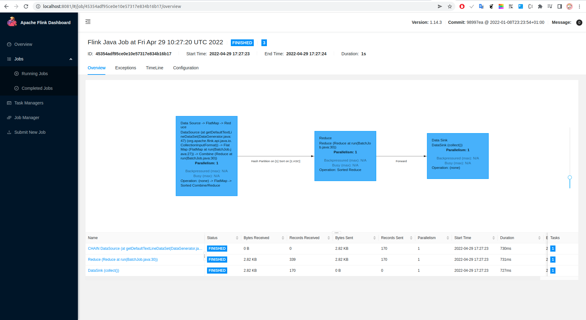

## how to run 

- docker-compose up 

- check container

```bash
long@hello:~$ docker ps
CONTAINER ID   IMAGE                           COMMAND                  CREATED          STATUS          PORTS                                                 NAMES
da13e8549c85   flink:1.14.3-scala_2.12-java8   "/docker-entrypoint.…"   51 seconds ago   Up 26 seconds   6123/tcp, 8081/tcp                                    taskmanager-name
918b2aa6d170   flink:1.14.3-scala_2.12-java8   "/docker-entrypoint.…"   51 seconds ago   Up 26 seconds   6123/tcp, 0.0.0.0:8081->8081/tcp, :::8081->8081/tcp   jobmanager-name

```

- build -> send file 

```aidl
bash bin/build-send.sh
```

- exec & run 

```aidl
docker exec -it jobmanager-name bash
bin/flink run  flink-test-1.0-SNAPSHOT-jar-with-dependencies.jar 
```

- check ui ```http://localhost:8081/```

