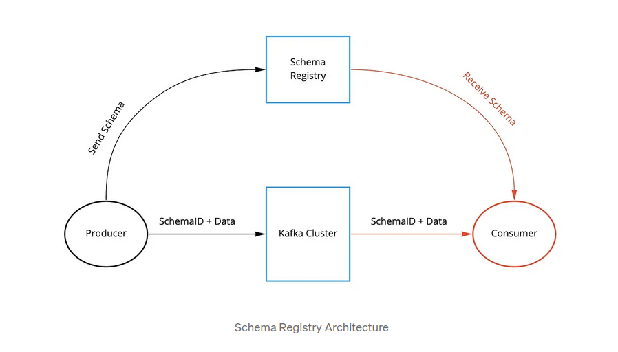

streaming datalake house

cần 1 thằng làm schema registry -> 

- tăng tốc độ  khi 2 thằng đọc, ghi có thể thồng nhất schema?
- quản lí version schema -> quan trọng.

https://medium.com/slalom-technology/introduction-to-schema-registry-in-kafka-915ccf06b902

postgres từ 17 mới đọc dc từ con rep

PostgreSQL (for all versions ⇐ 16) supports logical replication slots on only primary servers

https://debezium.io/documentation/reference/stable/connectors/postgresql.html#supported-postgresql-topologies
