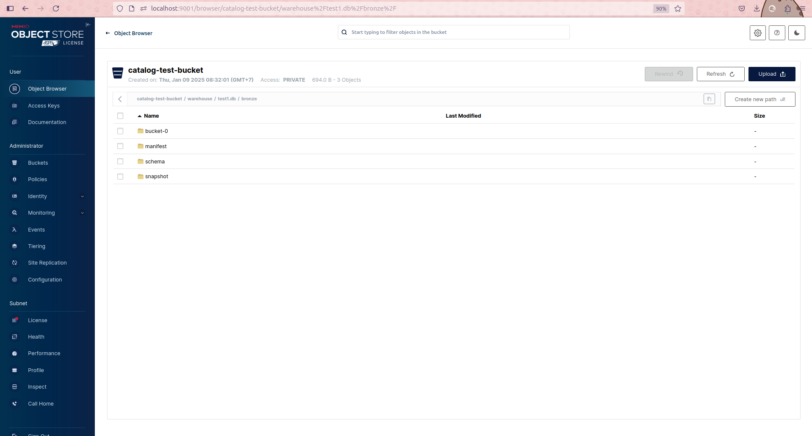
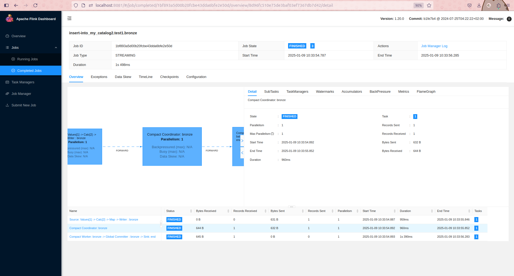

1. sql init

```
./bin/sql-client.sh
./bin/sql-client.sh embedded -j /Users/openinx/software/apache-iceberg/flink-runtime/build/libs/iceberg-flink-runtime-5f90476.jar shell
```

2. kết nối tới catalog 

giống như thằng trino kết nối tới hive thì cần cấu hình của hive.properties (bao gồm thông tin thrift + storage = core và hdfs site)

flink cũng kết nối tới hive = hive-site.xml (cx bao gồm thông tin thrift + s3 storage chẳng hạn)

mỗi lần tắt đi bật lại nó sẽ mất hết catalog đã  có

```sql
Flink SQL> show catalogs;
+-----------------+
|    catalog name |
+-----------------+
| default_catalog |
+-----------------+
1 row in set

Flink SQL> show databases;
+------------------+
|    database name |
+------------------+
| default_database |
+------------------+
1 row in set

```

mỗi lần bật lại sql phải tạo lại catalog: 


https://nightlies.apache.org/flink/flink-docs-release-1.20/docs/connectors/table/hive/hive_catalog/

https://paimon.apache.org/docs/master/concepts/catalog/ : 
-  Filesystem Catalog

```
-- Flink SQL
CREATE CATALOG my_catalog WITH (
    'type' = 'paimon',
    'warehouse' = 'hdfs:///path/to/warehouse'
);

```
-  Hive Catalog 

```
CREATE CATALOG my_hive WITH (
    'type' = 'paimon',
    'metastore' = 'hive',
    -- 'warehouse' = 'hdfs:///path/to/warehouse', default use 'hive.metastore.warehouse.dir' in HiveConf  -> thế mà ở dưới mình chỉnh mãi k được thôi kệ đi tính sau. có khi dùng luôn catalog của file system luôn cho lành
);
```


(k biết cấu hình lưu lại ở đâu hic để mình không cần tạo lại catalog)

```sql
Flink SQL> create catalog paimon
> with ( 'type'='paimon',
>      'metastore'='hive',
>      'hive-conf-dir'='/opt/flink/conf/');

Flink SQL> use catalog paimon; 
[INFO] Execute statement succeeded.

Flink SQL> show databases;
+---------------+
| database name |
+---------------+
|       default |
|     medallion |
|       test_db |
+---------------+
3 rows in set

Flink SQL> use database test_db;
[ERROR] Could not execute SQL statement. Reason:
org.apache.flink.sql.parser.impl.ParseException: Encountered "test_db" at line 1, column 14.
Was expecting one of:
    <EOF> 
    ";" ...
    "." ...

Flink SQL> use test_db;
[INFO] Execute statement succeeded.

Flink SQL> CREATE TABLE bronze (
>     event_id STRING,
>     user_id STRING,
>     event_type STRING,
>     eCREATE TABLE bronze (AMP(3),
>     event_id STRING,
>     user_id STRING, AS PROCTIME()
);

```

-> giờ nó sẽ tạo tbls tại db postgres tương ứng tỏng db hive


# nếu cố tình chạy bằng hive mà muốn chỉnh path của warehouse nó báo lỗi gì ấy 

```sql
create catalog test7
with ( 'type'='paimon',
    'metastore'='hive',
    'hive-conf-dir'='/opt/flink/conf/',
    -- 'uri' = 'thrift://10.208.164.167:9083',
    -- 'warehouse' = 's3://catalog-test-bucket/warehouse',  -> không cần điền mấy thông tin này vì nó phải ăn theo config hive-site.xml mà mình cấu hình bằng hive-conf-dir
    -- 's3.endpoint' = 'http://10.208.164.167:9000',
    -- 's3.access-key' = 'minio',  
    -- 's3.secret-key' = 'minio123',
    -- 's3.path.style.access' = 'true',
    'location-in-properties'='true');
Not Found: s3://catalog-test-bucket/warehouse/user.sys


Flink SQL> CREATE CATALOG catalog_test1111 WITH (
>     'type' = 'paimon',
>     'metastore' = 'hive',
>     'uri' = 'thrift://10.208.164.167:9083',
>     'warehouse' = 's3://catalog-test-bucket',
>     's3.endpoint' = 'http://10.208.164.167:9000',
>     's3.access-key' = 'minio',  
>     's3.secret-key' = 'minio123',
>     's3.path.style.access' = 'true',
>     'location-in-properties' = 'false'
> );
[ERROR] Could not execute SQL statement. Reason:
java.lang.IllegalArgumentException: path must be absolute    -> catalog phải tạo ở 1 thư mục, không được tạo tạị 1 bucket, giống như mặc định 
warehouse là s3a://paimonmetastore/warehouse

Flink SQL> CREATE CATALOG catalog_test4444 WITH (
>     'type' = 'paimon',
>     'metastore' = 'hive',
>     'uri' = 'thrift://10.208.164.167:9083',
>     'warehouse' = 's3://catalog-test-bucket/test',
>     's3.endpoint' = 'http://10.208.164.167:9000',
>     's3.access-key' = 'minio',  
>     's3.secret-key' = 'minio123',
>     's3.path.style.access' = 'true',
>     'location-in-properties' = 'false'
> );
> 
[INFO] Execute statement succeeded.

```

nói chung cx k muốn chỉnh lại chỗ này vì k hiểu cơ chế của nó 

mình sẽ khogon chỉnh dược warehouse vì nó là cấu hình của hive ?

```sql
SELECT hive_db.public."DBS"."NAME" AS database_name, hive_db.public."TBLS"."TBL_NAME" AS table_name, hive_db.public."SDS"."LOCATION" as path_hdfs
FROM hive_db.public."TBLS"
JOIN hive_db.public."DBS" ON hive_db.public."TBLS"."DB_ID" = hive_db.public."DBS"."DB_ID"
JOIN hive_db.public."SDS" ON hive_db.public."TBLS"."SD_ID" = hive_db.public."SDS"."SD_ID";
```

-> cái này tạo vớ vẩn mà k có trong hms là đến lúc đọc ra k thấy gì  (mặc dù đã có thu mục trên minio)

2.  paimon local filesystem

```sql
CREATE CATALOG my_catalog2 WITH (
    'type' = 'paimon',
    'warehouse' = 's3://catalog-test-bucket/warehouse',
    's3.endpoint' = 'http://10.208.164.167:9000',
    's3.access-key' = 'minio',  
    's3.secret-key' = 'minio123',
    's3.path.style.access' = 'true'
);


CREATE TABLE bronze (
    event_id STRING,
    user_id STRING,
    event_type STRING,
    event_timestamp TIMESTAMP(3),
    raw_data STRING,
    processing_time AS PROCTIME()
);


```




```sql
INSERT INTO bronze (event_id, user_id, event_type, event_timestamp, raw_data)
VALUES
('E1', 'U1', 'click', TIMESTAMP '2025-01-01 12:30:45', '{"key": "value1"}'),
('E2', 'U2', 'purchase', TIMESTAMP '2025-01-01 12:31:30', '{"key": "value2"}');
```





```

show catalogs;
show databases;
show tables;

show current catalogs;
show current databases;

```


