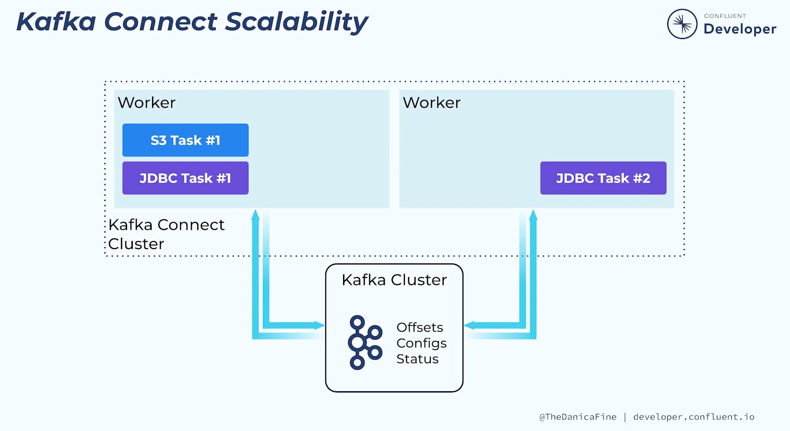

kafka connect deployment

cluster: nó lưu hết thông tin connector configurations, status, and offset information trên kafka

-> thích thêm worker thì nó chạy thêm task thôi 

cấu hình thì cần cái group.id giống là oke

New workers will either start a new group or join an existing one with a matching group.id

ref cấu hình chi tiết trong file properties: https://docs.confluent.io/platform/7.8/connect/references/allconfigs.html

cấu hình worker: https://docs.confluent.io/platform/current/connect/userguide.html#configuring-and-running-workers

doc kafka connect: https://docs.confluent.io/platform/current/connect/design.html

Chú ý deploy: 

không cần cùng server chạy broker để có thể tăng hiệu năng

For improved performance, Connect should be ran independently of the broker and Zookeeper machines. 